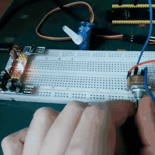

# emb16-homework

## Модуль 3.5. Домашнє завдання: Керування сервоприводом за допомогою PWM

### Хід роботи:
1. Зібрано схему з сервоприводом SG90 та потенціометром, підключеними до відповідних пінів MCPWM/LEDC та АЦП мікроконтролера.
2. У файлі [main.c](src/main.c) реалізовано алгоритм на чистому ESP-IDF:
   - Налаштовано модуль ШІМ на потрібну частоту та роздільну здатність для генерації імпульсів керування сервоприводом;
   - Налаштовано зчитування даних потенціометра через АЦП у режимі `adc_oneshot`;
   - Додано обробку мертвої зони для усунення апаратних шумів у крайньому лівому положенні;
   - Обрізано верхню межу діапазону потенціометра до кута повороту сервоприводу для забезпечення керування в пропорції 1:1;
   - Реалізовано функцію перерахунку обчисленого кута у ширину імпульсу та оновлення регістрів ШІМ;
   - Виведено поточний кут відхилення від крайнього лівого положення у консоль за допомогою `ESP_LOGI()`.

### Результат:
Опановано низькорівневу роботу з ШІМ та АЦП у середовищі ESP-IDF. Реалізовано синхронне керування положенням валу сервоприводу за допомогою потенціометра в пропорції 1:1 з відсіканням неробочого діапазону та відображенням кута в консолі.

Приклад роботи надано у .gif-анімації
