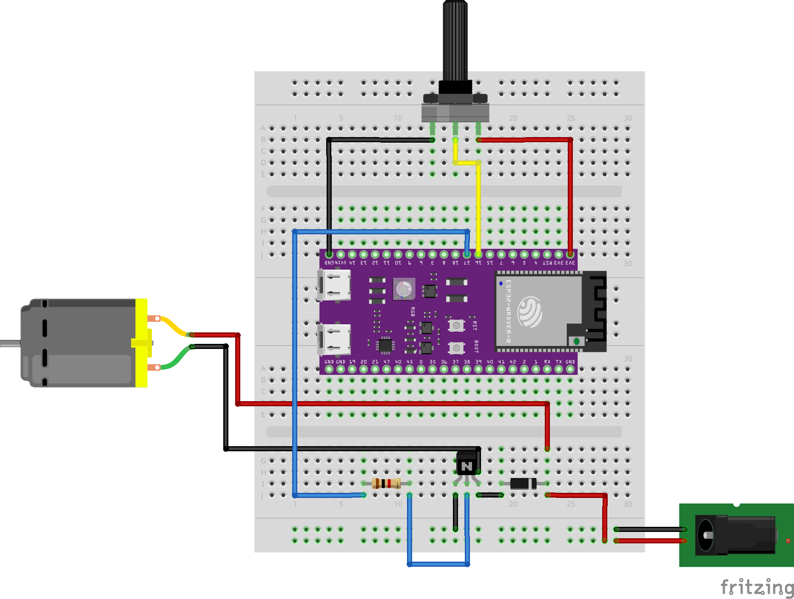

# emb16-homework
## Модуль 2.2. Домашнє завдання: Реле, час, переривання та PWM (ESP32)
### Завдання 2 (опційне): Програмний PWM

#### Діаграма підключення реалізована у Fritzing

#### Алгоритм роботи
 - мапимо піни для прийому АЦП сигналу з потенціометру, та відправки ШІМ сигналу на двигун;
 - встановлюємо ШІМ період у 10 мс;
 - починаємо основний цикл;
 - фіксуємо поточний час у мілісекундах;
 - зчитуємо показник з АЦП піна потенціометра;
 - преобразовуючи положення потенціометра визначаємо тривалість HIGH-фази;
 - визначаємо поточну фазу;
 - формуємо ШІМ сигнал зрівнюючи поточну фазу з ШІМ періодом.

 #### Висновок
У ході виконання завдання було отримано навички керування швидкістю DC двигуна шляхом формування ШІМ сигналу що змінюється через потенціометр.