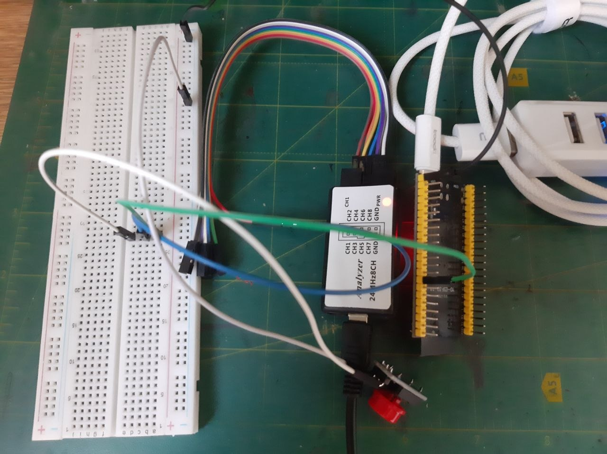
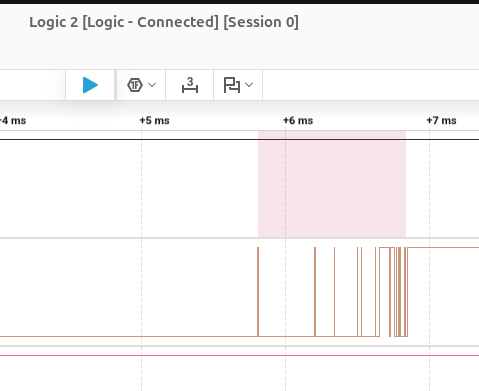

# emb16-homework
## Модуль 1.5. Домашнє завдання: Дослідження брязкоту контактів кнопки за допомогою логічного аналізатора та мікроконтролера
### 1. Схема підключення
Кнопку підключено до цифрового виводу 15. У розрив кнопки підключеной 1 канал аналізатора для дослідження натискань:

### 2. Хід роботи
Зробивши 10 натискань різної сили і швидкості, вдалось встановити що брязкіт виник на 2, 3, 5 та 7 натисканнях, у середньому довжиною кожного імпульса приб. 0.2-1.2 мс.
Приклад з брязкотом одного з натискань:

Брязкіт приблизно 0.5-1.2 мс
2, 3, 5, 7 натискання (та іноді відтискання)

У [main.cpp](src/main.cpp) додано код що дозволяє виводити лічильник натисканнь у консоль, також реалізовано алгоритм антибрязкоту з винесенням затримки зчитування натискання у константу DEBOUNCE_DELAY для можливості зручного проведення замірів контрольних значень без антибрязеоту.

### 3. Питання для аналізу
Вдалося встановити, що вцілому 1 натискання кнопки додає +3 на лічильнику натискань, при цьому іноді імпульси на аналізаторі - 8 (враховуючи саме натискання), деякі із імпульсів довжиною приблизно 5 мікросекунд, або навіть менше, схоже що вхідний пін esp їх навіть не реєструє як зміну стану. Показник антибрязкіту у 2 мс. був би достатнім.

### 4. Додаткове (опційно)
Після декількох прогонів прошивки з різним значенням константи DEBOUNCE_DELAY вдалося встановити що кількість брязкоту різко зменшується на значенні 1 мс., та повністю зникає на значенні 2 мс., що співпадає з показниками аналізатора у тому що більшість брязкоту генерувалось імпульсами довжиною 0.5-1.2 мс.