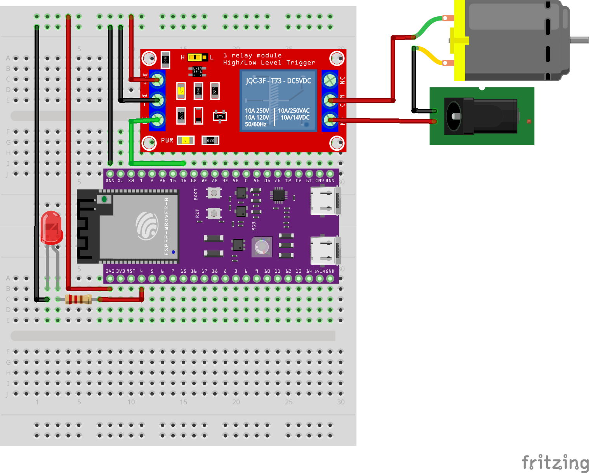

# emb16-homework
## Модуль 2.5. Домашнє завдання: Таймери
### Хід роботи
#### Діаграма підключення dc двигуна через реле

#### Опис алгоритму роботи
У [main.c](src/main.c) реалізовано наступний алгоритм:
  - резервуємо піни під керування реле та сигнальний світлодіод;
  - резервуємо інтервали робои, замість 1 години та 15 хвилин використаємо 10 сек., та 3 сек. відповідно;
  - обявляємо функцію set_fan_state() що керуватиме станом двигуна;
  - обєявляємо callback- функції periodic_timer_callback() та fan_off_timer_callback(), де перша буде відповідати за періодичне увімкнення двигуна, а друга за вимкнення;
  - головна функція app_main:
    * конфігуруємо цифрові піни;
    * ініціюємо таймери вимкнення та увімкнення відповідно;
    * запускаємо перший цикл негайно або з періодом;
    * контролюємо можливий аарійний стан та перезапуск за допомогою Task Watchdog Timer;
    * нескінченний цикл while працює порожнім, з одним лише механізмом скидання Watchdog та контролем сну головного таску без блокування таймерів.

### Висновок
Під час виконання завдання отримано навички у керуванні dc двигуном через реле за допомогою таймерів, здійснено контроль за допомогою Watchdog.